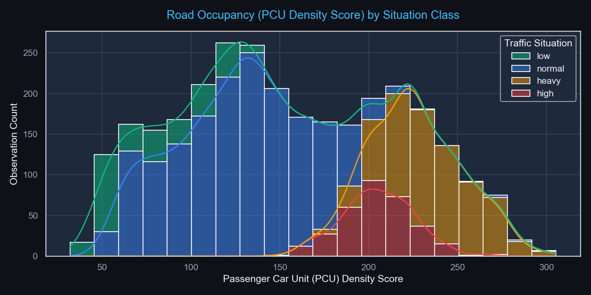
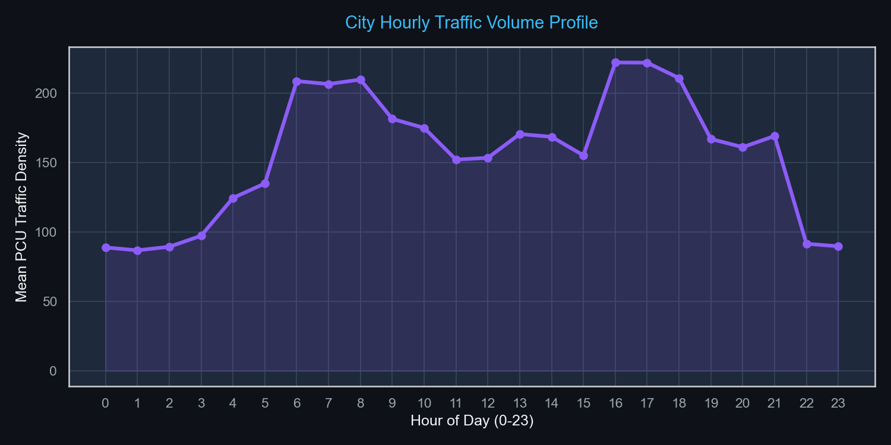
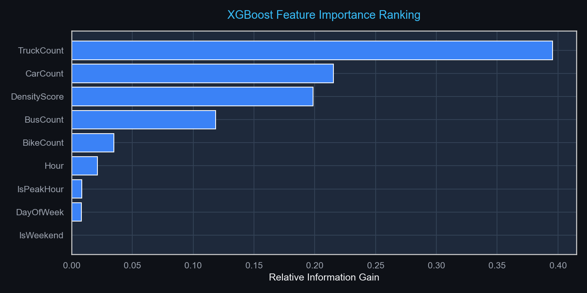
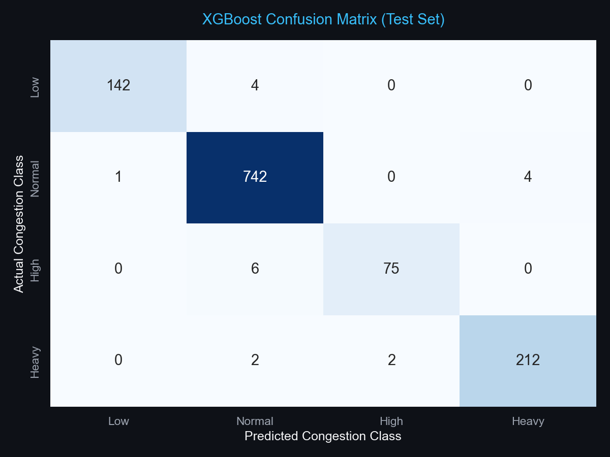

# AI-Based Smart Traffic Management System

[](https://www.python.org/)
[](LICENSE)
[](tests/)

An end-to-end, portfolio-grade Smart Traffic Analytics and Congestion Prediction platform designed to optimize urban intersection efficiency. The system ingests multi-lane loop telemetry, computes road occupancy using Passenger Car Unit (PCU) density formulas, predicts multi-class congestion scenarios and vehicle volumes, dynamically adjusts signal durations, and logs operations to an audit ledger.

---

## 🏛️ System Architecture

The project is designed with a modular, layered software architecture adhering to clean-code principles:

```
├── assets/screenshots/          # Data visualization PNG charts
├── configs/                     # System configuration schemas
│   └── config.yaml              # Central YAML config settings
├── datasets/                    # Data storage layer
│   ├── raw/                     # Original loop sensor logs
│   └── processed/               # Cleaned splits (train, test, validation)
├── models/trained/              # Serialized joblib model pipelines
├── notebooks/                   # Jupyter analysis & development logs
├── outputs/                     # Database & reporting outputs
│   ├── reports/                 # Evaluation summaries
│   └── traffic_management.db   # Core SQLite database store
├── src/                         # System source packages
│   ├── analytics/               # Feature engineering & PCU logic
│   ├── dashboard/               # Streamlit multi-page interface views
│   ├── database/                # SQLite connection context managers
│   ├── optimization/            # Signal green-time scheduling algorithms
│   ├── prediction/              # Machine learning training & inference
│   └── utils/                   # Shared logger & config loader
├── tests/                       # Pytest test suite
├── app.py                       # Dashboard entry point
├── generate_assets.py           # Charts generation script
└── train_model.py               # Model training script
```

---

## 🚀 Key Features

1. **Analytical Ingestion & PCU Calculation**
   - Ingests counts for Cars, Bikes, Buses, and Trucks.
   - Calculates a weighted **Passenger Car Unit (PCU)** density score representing actual road space usage:
     $$\text{PCU Density} = (\text{Cars} \times 1.0) + (\text{Bikes} \times 0.2) + (\text{Buses} \times 2.5) + (\text{Trucks} \times 3.0)$$
   - Extracts temporal features: `Hour`, `DayOfWeek`, `IsWeekend`, `IsPeakHour` (peak windows: 7:00–9:30 AM, 4:30–7:30 PM).

2. **Predictive Machine Learning Pipelines**
   - **Congestion Classifier**: Predicts traffic congestion situation (`low`, `normal`, `high`, `heavy`) using **XGBoost** and **Random Forest** multi-class models.
   - **Volume Regressor**: Forecasts total vehicle load in upcoming 15-minute intervals.
   - Implements baseline models (Logistic Regression, Ridge Regression) for validation checks.

3. **Dynamic Signal Optimization Engine**
   - Simulates a 4-way intersection (North, South, East, West).
   - Computes real-time dynamic green signal durations proportional to approach densities (clamped between 15s and 90s).
   - Estimates queuing delay reductions compared to static 30-second cycles.

4. **Streamlit Monitoring Dashboard**
   - Features KPI metric cards, time-series volume line plots, vehicle mix pie charts, density heatmaps, an interactive simulator, and database historical logs.

5. **Audit Ledger Logging**
   - Records every model inference run and signal timing schedule in local SQLite database tables for municipal analysis.

---

## 📈 Visualizations & Insights

Here are some of the analytical charts generated from the city telemetry dataset:

### 1. Traffic Density Distribution
Shows how the calculated Passenger Car Unit (PCU) score correlates directly with congestion label classifications:


### 2. City Hourly Traffic Volume Profile
Visualizes average traffic loads across different hours, illustrating morning and evening rush hours:


### 3. Model Feature Importances
Displays which variables impact the XGBoost Classifier's congestion level predictions the most:


### 4. Classifier Confusion Matrix
Illustrates classification performance on the test split:


---

## ⚙️ Installation & Getting Started

### 1. Clone & Set Up Virtual Environment
```bash
git clone https://github.com/your-username/traffic-management-system.git
cd traffic-management-system

# Create and activate virtual environment
python -m venv venv
venv\Scripts\activate   # On Windows
source venv/bin/activate # On Unix/macOS
```

### 2. Install Dependencies
```bash
pip install -r requirements.txt
pip install -e .
```

### 3. Run Data Ingestion & Engineering Pipeline
Copies raw datasets, cleans the tables, generates features, performs train-test splits, and seeds the SQLite database:
```bash
python -m src.analytics.density_analyzer
```

### 4. Train Predictive Models
Trains baseline models, Random Forests, and XGBoost models, saving outputs to `models/trained/`:
```bash
python train_model.py
```

### 5. Run Verification Unit Tests
Executes the `pytest` test suite to check that the database, analyzer, and optimizer modules behave correctly:
```bash
pytest
```

### 6. Launch the Streamlit Dashboard
```bash
streamlit run app.py
```

---

## 📊 Model Performance Summary

| Model Type | Algorithm | Metric (Test Set) | Metric (Validation Set) |
| :--- | :--- | :--- | :--- |
| **Classification** | XGBoost Classifier | **98.40% Accuracy** | **87.20% Accuracy** |
| **Classification** | Random Forest | 97.73% Accuracy | 87.06% Accuracy |
| **Regression** | XGBoost Regressor | **1.67 RMSE** | **1.27 RMSE** |
| **Regression** | Random Forest | 2.03 RMSE | 1.36 RMSE |

---

## 📄 License

This project is licensed under the MIT License - see the [LICENSE](LICENSE) file for details.
